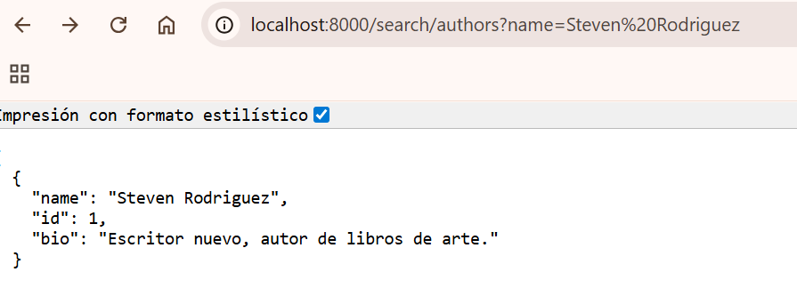
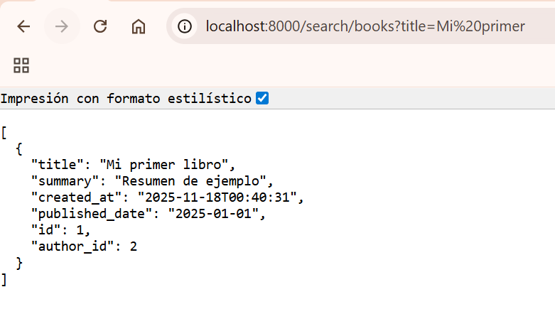

# API de Libros y Autores

Proyecto FastAPI para gestionar autores y libros. La API está preparada para ejecutarse localmente con un entorno virtual o dentro de contenedores Docker (MySQL + API).

---

## Características

- FastAPI
- Autenticación HTTP Basic (desarrollo)
- Validación con Pydantic
- CRUD básico para autores y libros
- Búsqueda por nombre de autor y título de libro

---

## Credenciales

- Usuario: `admin`
- Contraseña: `password123`

---

## Estructura principal

- `app/` : código fuente principal
  - `app/main.py` — entrada FastAPI
  - `app/db/database.py` — configuración de SQLAlchemy, `get_db`, `wait_for_mysql`
  - `app/db/init_db.py` — inicialización/creación de tablas espera a que MySQL esté disponible y crea tablas (se ejecuta desde `app.main` al arrancar).
  - `app/db/models.py` — modelos SQLAlchemy (`AuthorDB`, `BookDB`)
  - `app/db/crud.py` — funciones CRUD + búsqueda
  - `app/schemas/` — esquemas Pydantic
  - `app/auth/auth.py` — dependencia de autenticación
- `scripts/` : utilidades
  - `scripts/request.py` — cliente de prueba para crear autor y libro
- `Dockerfile`, `docker-compose.yml`, `requirements.txt`

---

## Endpoints disponibles

- POST `/authors/` — Crear autor

  - Body JSON:
    ```json
    {
      "name": "Steven Rodriguez",
      "bio": "Escritor nuevo, autor de libros de arte."
    }
    ```
- GET `/authors/` — Listar autores
- POST `/books` — Crear libro

  - Body JSON:
    ```json
    {
      "title": "Mi primer libro",
      "author_id": 1,
      "published_date": "01/01/2025",
      "summary": "Resumen de ejemplo"
    }
    ```
- GET `/books` — Listar libros
- GET `/search/authors?name=...` — Buscar autores por nombre (case-insensitive) `http://localhost:8000/search/authors?name=Steven%20Rodriguez `
- GET `/search/books?title=...` — Buscar libros por título (case-insensitive) `http://localhost:8000/search/books?title=Mi%20primer`
- 

---

## Cómo realizar requests

### Usando curl

Crear autor:

```bash
curl -u admin:password123 -H "Content-Type: application/json" \
  -d '{"name":"Steven Rodriguez","bio":"Escritor nuevo"}' \
  http://localhost:8000/authors/
```

Listar autores:

```bash
curl -u admin:password123 http://localhost:8000/authors/
```

Buscar autor por nombre (ej. "Steven Rodriguez"):

```bash
curl -u admin:password123 "http://localhost:8000/search/authors?name=Steven%20Rodriguez"
```

Crear libro:

```bash
curl -u admin:password123 -H "Content-Type: application/json" \
  -d '{"title":"Mi primer libro","author_id":1,"published_date":"01/01/2025","summary":"Resumen"}' \
  http://127.0.0.1:8000/books
```

Buscar libro por título:

```bash
curl -u admin:password123 "http://localhost:8000/search/books?title=Mi%20primer%20libro"
```

### Usando Python (`requests`)

```python
import requests
from requests.auth import HTTPBasicAuth

resp = requests.get(
    'http://localhost:8000/search/authors',
    params={'name': 'Steven Rodriguez'},
    auth=HTTPBasicAuth('admin', 'password123')
)
print(resp.status_code, resp.json())
```

### Desde el navegador / Swagger UI

- Abrir `http://localhost:8000/docs` para la interfaz Swagger. Si el navegador solicita credenciales HTTP Basic, introducir `admin` / `password123`.
- También al abrir directamente la URL de búsqueda en el navegador y solicitara credenciales:
  `http://localhost:8000/search/authors?name=Steven%20Rodriguez`

---

## Docker (comandos)

1) Construir y levantar servicios (API + MySQL):

```powershell
docker compose up --build -d
```

2) Ver logs en tiempo real:

```powershell
docker compose logs -f
```

3) Parar y eliminar contenedores:

```powershell
docker compose down
```

Nota: El `Dockerfile` ejecuta `uvicorn app.main:app`, y `docker-compose.yml` monta el proyecto en `/app`.

---

## Ejecucion local sin Docker

1) Activar entorno virtual e instalar dependencias:

```powershell
& .\.venv\Scripts\Activate.ps1
python -m pip install -r requirements.txt
```

2) Ejecutar la app con reload:

```powershell
& .\.venv\Scripts\python.exe -m uvicorn app.main:app --reload
```

---

## Scripts definicion de request

- `scripts/request.py` — cliente de ejemplo que crea un autor y un libro de prueba.

---

## Próximas mejoras

- Usar `.env` para variables sensibles (DATABASE_URL, credenciales).
- Añadir paginación (`skip`/`limit`) a listados y búsquedas.

## Video

[Ejecucion API](Ejecucion API) : https://www.loom.com/share/4343af1884af4caab6360ca8897178f8?sid=fe0e4be3-42f9-4cec-97a8-e4d4dfc1d3d6
